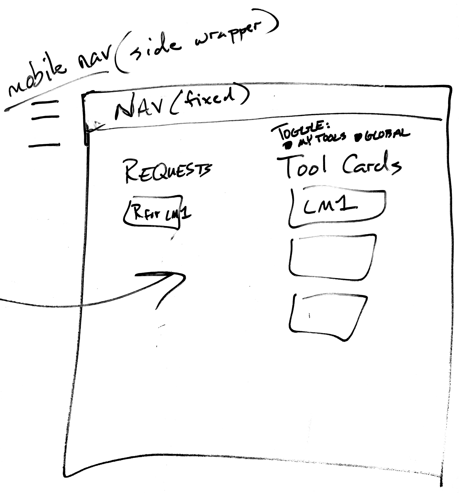
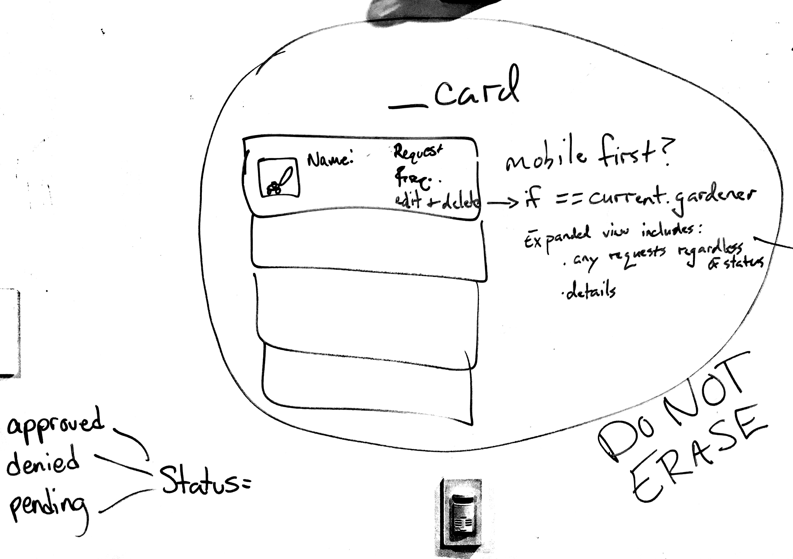
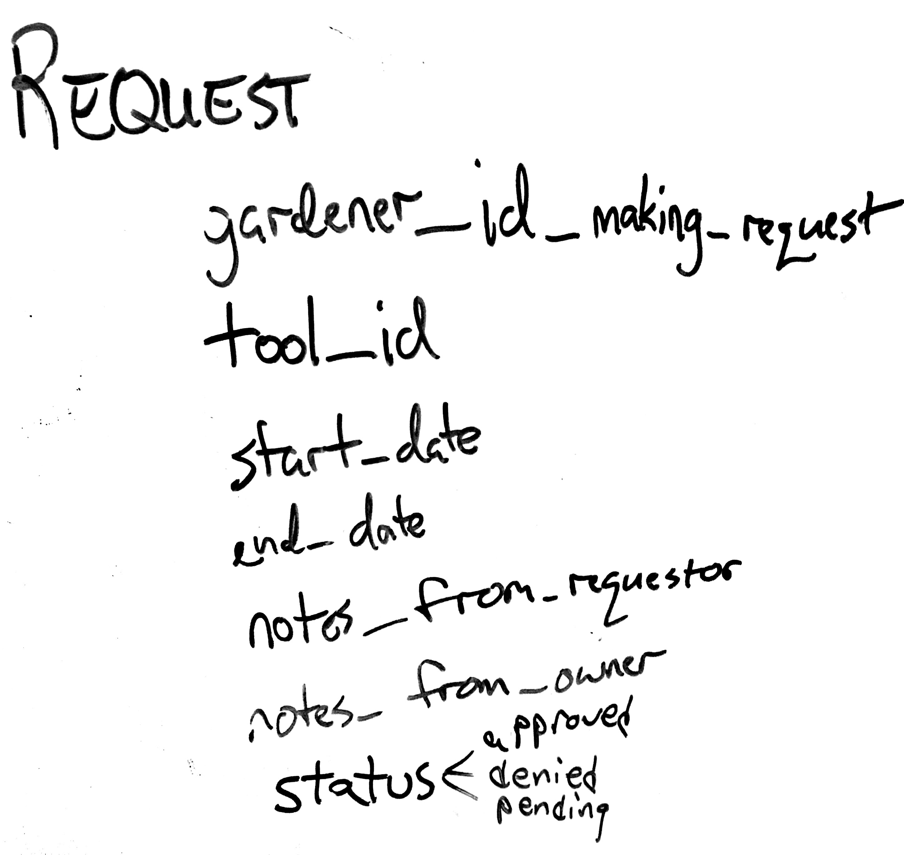

# Gardenhood - Your Neighborhood Toolshed

Project Link: [Gardenhood](https://gardenhood.herokuapp.com/)  
Trello Board: [Trello Board](https://trello.com/b/opi8TnCI/gardenhood-project-4)

## Finished Product:

## Overview

<b>Gardenhood</b> allows users to add their tools to a neighborhood toolshed, loan them to neighbors, and request to borrow tools from others.

This Ruby on Rails application utilizes user authentication and authorization and performs CRUD operations
while following RESTful best practices for routing.

## Technologies Used

* **Languages:** HTML5, CSS3, JavaScript, Ruby 2.2.4
* **Front-End Framework:** Foundation 6
* **JavaScript Libraries:** jQuery, MasonryJS
* **Server-Side:** Rails 5.0
* **Database:** PostgreSQL
* **File Management:** Amazon Web Services S3
* **Security:** Devise
* **Mockups:** Whiteboard
* **Project Planning & User Stories:** Trello
* **Text Editor:** Sublime Text 3, Atom

## Features

* Users can register, log in, and see the tools in their neighborhood toolshed. When logged in, the root route redirects to the toolshed.
* Tools in the toolshed are displayed in interactive cards. They show a picture, name, and the owner's username. Clicking the card opens it to reveal details about the tool and a button to request the tool from the owner.
* Users can create, edit, and delete their tools from the toolshed.
* Users can view tool requests on a requests page. This shows their requests for other tools and requests from other users for their tools.
* Users can create, edit, and delete requests for tools from other users.
* Users can approve or deny requests for their tools.
* Users can edit their user profile.

## Build Process

### Mockups and Features

We created basic mockups as we thought through the features we wanted for this application.  This was immensely beneficial, as it helped us think through the best way to bring the intended functionality to life.

#### Gardenhood Mockups

---

## Future Development

There are many things we would love to change, modify, or add to this project.

#### Tweaks of current features
* Add a toggle to the toolshed view where a user could choose to see just the tools they own.
* Make a user's owned tools stand out in some visual way in the global toolshed view.
* Provide contact information between users when a tool request is accepted.

#### Features for future implementation
* Add a notification when a user has new requests for tools.
* Add a notification when a user's request has been either approved or denied.
* Add a communication or messaging tool so that users can communicate without having to share too much contact information.
* Add a rating system for users (both as borrowers and providers of tools) to create trust between users.

## The Team:

| Coding Wizards |                          GitHub                         |                          Email Address                          |                Website               |                       Twitter                       |
|----------------|:-------------------------------------------------------:|:---------------------------------------------------------------:|:------------------------------------:|:---------------------------------------------------:|
| Justin Doak    |           [jhdoak](https://github.com/jhdoak)           |          [justin@jhdoak.com](mailto:justin@jhdoak.com)          | [jhdoak.com](https://www.jhdoak.com) | [@justin_doak](https://www.twitter.com/justin_doak) |
| Josua Lovell   | [joshualylelovell](https://github.com/joshualylelovell) | [joshualylelovell@gmail.com](mailto:joshualylelovell@gmail.com) |                                      |                                                     |
